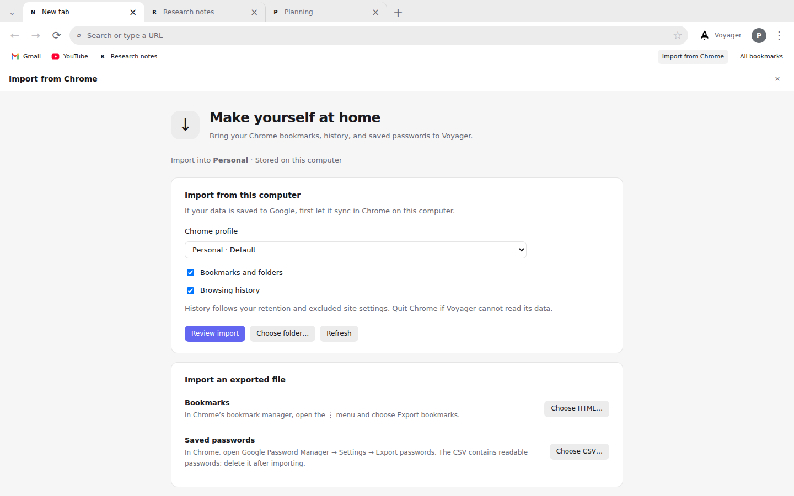

# Voyager

[](https://github.com/keeganarko/voyager/actions/workflows/security.yml)

### A little less browsing. A little more understanding.

A desktop browser with familiar tabs and navigation. Bring your Chrome bookmarks
and history, explore pages side by side, and ask an assistant to find saved pages.



*Current renderer with sample tabs, bookmarks, and a simulated Chrome profile.*

[Earlier prototype walkthrough](docs/media/voyager.mp4) · [Setup and features](docs/guide.md) · [Security status](docs/SECURITY-OPERATIONS.md)

## Make space for the work

- **Keep related tabs together.** Groups, pinned sites, and separate profiles help organize each project.
- **Read with context.** Ask about the current page, bring another tab into the conversation, and follow the sources.
- **Compare without switching.** Put up to four pages in resizable panes.
- **Bring your saved pages.** Import Chrome bookmarks and history into a local profile, then search them from the address bar or assistant.
- **Choose what the assistant can do.** Review permission requests before it takes external actions.

## Try it

Voyager is a prototype for Windows, macOS, and Linux. Install **Node.js 24+**
and **Git**. Linux also needs an unlocked system keyring. Then run:

```sh
git clone https://github.com/keeganarko/voyager.git
cd voyager
npm ci
npm run dev
```

Browsing works without an API key. To use the assistant, add an Anthropic API
key in **Settings → AI**. Using the assistant sends the context it needs to
Anthropic after context-sharing consent. Review what you share, especially on
sites containing personal or work information.

Existing installers are unsigned and update manually. The source now includes
signed-update verification, local threat blocking, conservative download checks,
encrypted browser records, and tighter assistant permissions. Production signing,
an update rehearsal, and independent testing remain release requirements.
**Use Voyager as a testing browser until those checks are complete.**

| Your choice | What Voyager does |
|---|---|
| Browse without AI | Keeps assistant features optional; no API key required. |
| Ask about pages | Requests context-sharing consent and approvals for connector calls and website actions. |
| Save browser records | Encrypts the app database with an OS-protected key; website caches and downloads are separate. |
| Download a file | Requires HTTPS, blocks risky file types, and checks common executable signatures. |
| Check protection | Shows update and threat-list status in **Settings → Security**. |

Domain blocking does not provide Chrome Safe Browsing coverage. Read the
[security comparison](docs/SECURITY-AUDIT-2026-09-04.md) and
[remaining release requirements](docs/SECURITY-OPERATIONS.md). The
[validation record](docs/SECURITY-VALIDATION-2026-09-04.md) lists exactly what passed.

## Take a first look

1. Open a few pages and group them around a project.
2. Open the Voyager sidebar and ask about the current page.
3. Use `@` to add another tab, or `/` to choose a skill.

## Bring Chrome with you

Open **⋮ → Import from Chrome**, choose a Chrome profile, and review the import
before copying bookmarks and history. Chrome bookmark HTML exports and password
CSV exports are also supported. Imports preserve existing records and stay local.

The bookmarks bar keeps saved sites below the address bar. Star an item in
**All bookmarks** to move it to the start of the bar.

This is a one-time import. Google Sync, website sign-ins, extensions, open tabs,
and Google Collections do not transfer. See the [import guide and audit](docs/CHROME-IMPORT-AUDIT.md)
for supported data, privacy controls, and validation limits.

## Develop or package

Windows packaging also requires Visual Studio C++ Build Tools and the Windows
SDK for the Windows Hello helper. See the [setup guide](docs/guide.md).

```sh
npm run typecheck
npm test
npm run build

npm run dist:win    # Windows installer
npm run dist       # macOS Apple Silicon DMG
npm run dist:linux  # Linux AppImage
```

The [guide](docs/guide.md) covers profiles, privacy, permissions, extensions,
and the application structure.

## Give selected tabs a little help


Click **Agents** to choose a task and the tabs it can use. Research sources,
create comparison tables, watch loaded pages, or record a reusable workflow.
Page actions wait for your approval. Hide the panel while it works; the button
shows activity and requests for review.

Read the [agent guide](docs/AGENT-GUIDE.md) for setup, supported interactions and
limits, or explore the [architecture](docs/AGENT-ARCHITECTURE.md).

Built by [Keegan Choudhury](https://github.com/keeganarko).
[MIT License](LICENSE) · [Report a vulnerability privately](SECURITY.md)

The bundled threat data has a separate [GPL-3.0 license](resources/security/THREAT-LIST-NOTICE.md).
Public source is part of the security model; profiles, tokens, and signing keys
must remain outside Git. See [security operations](docs/SECURITY-OPERATIONS.md).
