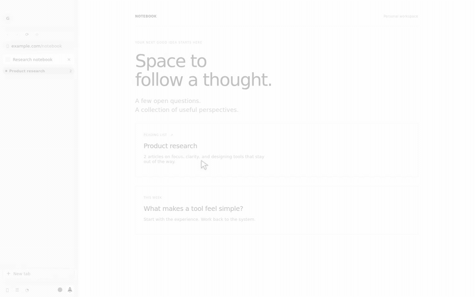

# Voyager

### A little less browsing. A little more understanding.

A desktop browser built around your work. Organize your tabs, explore pages
side by side, and ask an assistant that can use your browsing context.



*Actual prototype UI, presented in monochrome. Research pages and assistant response are illustrative.*

[Watch the walkthrough](docs/media/voyager.mp4) · [Setup and features](docs/guide.md) · [Build status and limitations](docs/AUDIT.md)

## Make space for the work

- **Keep related tabs together.** Groups, pinned sites, and separate profiles help organize each project.
- **Read with context.** Ask about the current page, bring another tab into the conversation, and follow the sources.
- **Compare without switching.** Put up to four pages in resizable panes.
- **Keep your workspace local.** Profiles, history, bookmarks, and settings live on your machine.
- **Choose what the assistant can do.** Review permission requests before it takes external actions.

## Try it

Voyager is a testing build for Windows, macOS, and Linux. Install Node.js 20+
and Git, then run:

```sh
git clone https://github.com/keeganarko/voyager.git
cd voyager
npm ci
npm run dev
```

Browsing works without an API key. To use the assistant, add an Anthropic API
key in **Settings → AI**. Using the assistant sends the context it needs to
Anthropic; local storage does not mean AI requests stay on your device.

The installer is unsigned and updates are manual. This is a prototype to try,
not yet a replacement for your primary browser. See the
[browser audit](docs/AUDIT.md) for the remaining work.

## Take a first look

1. Open a few pages and group them around a project.
2. Open the Voyager sidebar and ask about the current page.
3. Use `@` to add another tab, or `/` to choose a skill.

## Develop or package

```sh
npm run typecheck
npm test
npm run build

npm run dist:win    # Windows installer
npm run dist       # macOS Apple Silicon DMG
npm run dist:linux  # Linux AppImage
```

The [guide](docs/guide.md) covers profiles, privacy, permissions, extensions,
and the application structure.

Built by [Keegan Choudhury](https://github.com/keeganarko).
[MIT License](LICENSE)
