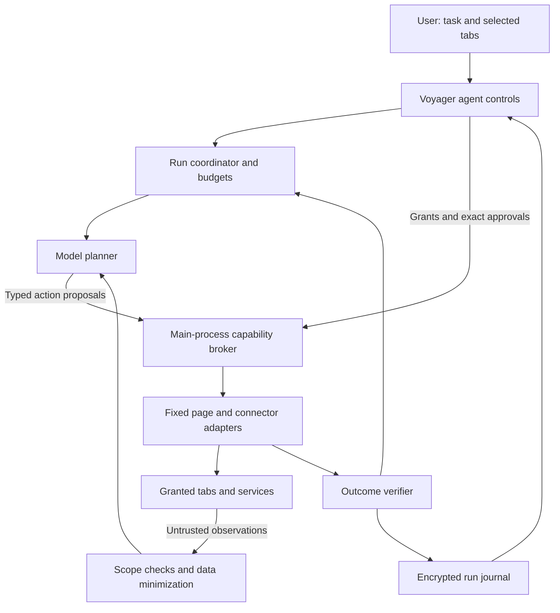

# Custom agents in Voyager

Status: architecture proposal, September 4, 2026. Source baseline: `237d17e`.
The runtime, contracts and interface below are proposed; this document does not
enable new automation or grant access to any website.

Give a task to a custom agent, choose the tabs it can use, and watch it produce
work you can inspect. Start with research across selected tabs. Extend to
approved interactions once the browser can reliably bind, authorize and verify
each action.

The working audience is someone moving information between several web apps.
That is an assumption from the requested workflows, not completed user research.
The product question is whether agents finish those workflows with less effort
than today's assistant, without making the person supervise every tiny step.

## Existing foundation

| Existing code | What it provides | What it does not provide |
|---|---|---|
| [engine.ts](../src/main/agent/engine.ts) | Anthropic tool loop, streaming steps, cancellation, approval ownership, 24-round cap | Durable jobs, restricted tools per custom agent, resource budgets, parallel task scheduler |
| [tools.ts](../src/main/agent/tools.ts) | Read pages/selection/history, open/close/group/split tabs, bookmarks, memory, approved field insertion | General element inspection, clicking, structured form automation, verified submission |
| [context.ts](../src/main/agent/context.ts) | Bounded page extraction, excluded-site and pause checks, citations | Per-run tab allowlists, frame/element references, structured tables, complete sensitive-data redaction |
| [pageBridge.ts](../src/main/browser/pageBridge.ts), [page.ts](../src/preload/page.ts) | Fixed helpers in the isolated preload world and navigation checks | A capability broker or general automation API |
| [skills.ts](../src/main/agent/skills.ts) | User-defined prompt templates and context options | Independently permissioned agent identities or executable plugins |
| [mcp.ts](../src/main/agent/mcp.ts) | Profile-owned HTTPS connectors, bounded transport, per-call approval | General OAuth discovery, local program execution or an OS sandbox |

The current engine supplies allowed window tab metadata and profile memory to
the conversation and exposes the browser tool set. A custom-agent permission
screen must not simply wrap that engine unchanged: context assembly, tools and
their execution all need the same enforced scope. A prompt saying "only use
these tabs" is not access control.

## Seven directions to explore

These are product options, not promises of implemented behavior.

| Direction | Example | Distinctive mechanism |
|---|---|---|
| Research team | Compare six suppliers, find conflicting claims and build a cited decision table | Separate readers with bounded context; a synthesizer consumes attributed findings |
| Workflow operator | Read an issue, prepare a response in a second app and stage a tracker update | Typed steps spanning tabs and approved connector tools; verify each destination |
| Personal page lens | Turn several messy pricing pages into one sortable comparison | Extract structured records and render a Voyager-owned view without editing the original sites |
| Page watcher | Tell me when a selected release note or availability field changes | Opt-in observations, semantic diffs, rate limits and expiring schedules |
| Teach-by-demonstration | Show a repetitive form workflow once, then reuse it with different inputs | Record chosen semantic actions; turn them into a parameterized recipe with assertions |
| Developer investigator | Reproduce a bug in a test account and correlate a UI failure with selected network events | Separately granted diagnostics, redacted console/request metadata and reproduction evidence |
| Guide-only agent | Highlight the next field and explain what to enter while I operate the site | The opposite of autonomous control: omit write access and let the person perform the action |

The page lens removes repeated website interaction altogether. The guide-only
agent tests whether helpful placement and explanation provide most of the value
without a general clicker. Both should be compared with full automation.

## Proposed architecture



The agent lives in Voyager. Each page exposes a small set of browser-installed
observation/action helpers in an isolated world. A website receives no agent
API, model key, grant token or privileged IPC bridge. Isolated JavaScript still
shares the DOM with page code; it does not make page content trustworthy.

### 1. Custom agent definitions and grants

A definition contains a name, instructions, requested tools, context policy,
output shape and limits. Saving or importing it grants nothing. The user starts
a run in a specific profile/window and explicitly binds selected tabs. The
broker issues an expiring grant from that selection and local policy.

Illustrative recipe; these fields are not an implemented import format:

```json
{
  "schemaVersion": 1,
  "name": "Compare these tabs",
  "instructions": "Compare the selected sources. Cite every factual row and mark missing evidence.",
  "requestedTools": ["tabs.listGranted", "page.read", "artifact.table"],
  "context": {
    "tabs": "selected-at-start",
    "history": false,
    "memory": false,
    "screenshots": false
  },
  "modelRoute": "configured-provider-with-context-consent",
  "trigger": "manual",
  "limits": { "maxTabs": 6, "maxSteps": 24, "maxWallTimeSeconds": 300 },
  "output": "comparison-table-with-sources"
}
```

Imported definitions are declarative data: no JavaScript, shell commands,
dependencies, remote executable code or wildcard privileges. Reject unknown
fields, tools and oversized inputs. Version definitions and show their requested
permissions; an update never inherits newly requested access silently.

The grant belongs to `(run, profile, window, tab, origin)` and expires. Frame and
document identity further constrain observations and actions. Start with exact
HTTP(S) origins, explicit tab IDs and no automatic enrollment of newly opened
tabs. Exclusions and privacy pause override every grant. Redirects and new
origins require revalidation; opaque origins and cross-origin frames are denied
in the first prototype. The agent never gets credentials through its tools.

Model requests travel through a browser-owned provider adapter. A separate
planner process could improve fault isolation, but an Electron utility process
with Node access is not an OS security sandbox. Untrusted executable agents
would need a separate containment design; this proposal deliberately uses
non-executable recipes. Voyager currently uses Anthropic; other providers and
local models are future adapter work, not an existing local-inference promise.

### 2. A broker that authorizes effects

The main process validates every tool argument with runtime schemas, resolves
its scope from the run rather than the model, and checks current policy before
dispatch. The model cannot choose its own action class, bypass approval, invoke
arbitrary JavaScript, issue raw CDP commands or fetch arbitrary URLs.

| Operation | Default treatment |
|---|---|
| Read granted page content | Allowed within the active context-sharing grant; still minimize data |
| Render a table, annotation or draft in Voyager | Local artifact; no website write |
| Open a URL, scroll, click or fill a website field | Potential external effect; explicit action approval initially |
| Invoke a connector | Existing per-call approval, plus run/tool/endpoint binding |
| Send, publish, purchase, delete, change permissions, handle credentials | Sensitive; never made automatic by an agent definition |

Scrolling can trigger lazy loads or tracking. A navigation can transmit data in
the URL. A field can autosave before Submit. Button labels and HTTP methods
cannot prove an operation is harmless. Broad approval-free clicking would undo
the existing security work. Start with per-action review; bounded approval of a
reviewed workflow is a later policy design, not an implicit grant here.

A prepared action binds the exact destination, argument digest, run and grant
version, document/frame identity, target element, expiry and expected state.
Approval is single-use. Revalidate and consume it immediately before execution;
changed input, navigation, profile switches, revoked access or stale targets
require a new preparation. This narrows race windows but cannot turn an arbitrary
website into a transactional service.

### 3. Observe, locate, act, verify

Add semantic snapshots: visible text, role/name, editable type, enabled state,
bounding rectangle, frame origin, document epoch and opaque element references.
Keep references in the adapter, expire them on document changes, and verify the
element is still the expected visible target before interaction. Do not ask the
model to invent selectors or keep stale screen coordinates across steps.

Preferred execution order:

1. A reviewed connector/site adapter with a narrow operation and an observable result.
2. Semantic DOM/accessibility targets via fixed browser helpers.
3. Explicitly enabled visual targeting for canvas or inaccessible widgets, with fresh screenshots and stricter review.

Electron exposes [CDP through `webContents.debugger`](https://www.electronjs.org/docs/latest/api/debugger).
A broker could use allowlisted accessibility/DOM/input commands internally;
never expose a debugger port or raw command channel to agents. Its attachment
lifecycle, DevTools conflicts and out-of-process frames need packaged tests.
[`sendInputEvent`](https://www.electronjs.org/docs/latest/api/web-contents#contentssendinputeventinputevent)
requires a focused containing window, so background input must be tested against
Voyager's actual BaseWindow/WebContentsView composition before being promised.

Start with top-level HTML and stop on unsupported frames, authentication prompts
and CAPTCHAs. Payment widgets, file pickers, closed shadow roots, canvas editors
and virtualized lists need specific support or manual takeover. No site security
or access restriction should be disabled to make an agent succeed.

After an action, read fresh state and test its postcondition: the right field
contains the draft, the expected record is visible, or the intended URL loaded.
Record `verified`, `failed` or `unknown`; a dispatched click is not proof of
success. A timeout after an external write is `unknown`, not permission to repeat
it. Use API idempotency keys when supported and reconcile receipts before retrying.
Browser history or restoring DOM text cannot undo a server-side transaction.

### 4. Dynamic behavior and cooperating agents

A run follows `created → running → awaiting_approval → running → completed`,
with `paused`, `cancelled`, `failed` and `unknown_outcome` states. Persist
checkpoints without retaining executable grants. After a crash, reconnect to
current tabs and ask to resume; never automatically replay unfinished writes.

Later, a coordinator can fan out read tasks to specialists and gather structured
findings. Each child gets only a subset of its parent's granted resources and
budget. Delegation cannot increase privileges. Findings retain source URL,
observation time and source trust; another agent's summary remains untrusted
derived data and cannot authorize a write. Share only explicitly selected data
between agents, even within one profile.

Allow simultaneous readers with snapshot versions; serialize writers per tab
and per known external resource. Tabs sharing a login can affect the same server
record, so a tab lock alone is insufficient. Begin without concurrent writes.
User takeover wins: stop issuing input, revoke leases and invalidate pending
approvals. Stopping cannot recall an already-sent request; show its status.

Watchers use bounded, debounced events and optional approved refresh schedules.
They do not continuously send the DOM to a model. Page events provide data, not
permission to spawn agents or write to another service. Default to manual runs;
background schedules need expiry, a visible indicator and renewal. A desktop
browser cannot monitor while fully closed without an additional OS service or
cloud worker, either of which creates new operational and privacy obligations.

### 5. Data flow and credentials

Distinguish three flows: context to a model, ordinary website requests, and
agent-requested transfers to another website/connector. Grants name permitted
destinations and the data being shared. Credentials stay in the existing vault
and origin-bound filling path; models receive neither cookies nor password,
token, localStorage or authorization-header dumps. Authentication and MFA remain
manual takeover in the first version.

Filter context before model requests, journaling and exports. Strip URL secrets,
exclude sensitive fields, and make screenshots separately opt-in. Text extraction
and screenshots can still contain confidential material outside recognized
fields, so redaction is a mitigation, not a confidentiality guarantee. Label
every derived artifact with its source scope and require approval before sending
it to a new destination. Source text cannot enlarge that permission.

Do not claim that allowing a page's origin constrains every server receiving its
data. A real website may use third-party scripts, WebSockets and its own backend
forwarding. An isolated session also does not make authenticated writes harmless.
Strict outbound containment would need a separately designed network policy and
compatibility tests. Preserve existing TLS, threat, download and connector
restrictions and do not add general network interception to the normal agent API.

### 6. Agents visibly attached to pages

Render the active agent, purpose, granted tabs, progress and Stop/Take over
controls in Voyager-owned browser UI. A page lens can display a comparison,
annotation or form preview alongside a page. Keep approvals outside the website
DOM; the page must not be able to replace their content or receive their clicks.

Use the existing native overlay layering in `browser/window.ts`: ordinary React
panels can be obscured by native page views. Content-attached highlights are
annotations only; all authoritative controls stay in persistent browser UI.
Provide a visible agent identity and an action journal of what was attempted and
verified, without storing model chain of thought or secrets. Default raw snapshots
to transient storage; encrypted persistent artifacts need retention/deletion
controls tied to profile deletion and explicit export.

## What this adds relative to Chrome and Dia

Chrome already offers Gemini assistance across tabs and auto browse for multi-step
website tasks, with confirmation for some sensitive actions. Clicking, form filling
and cross-tab assistance are not unique to Voyager. See [Google's announcement](https://blog.google/products-and-platforms/products/chrome/gemini-3-auto-browse/).

Chrome extensions also have [page scripting](https://developer.chrome.com/docs/extensions/reference/api/scripting),
[side panels](https://developer.chrome.com/docs/extensions/reference/api/sidePanel)
and substantial [CDP access](https://developer.chrome.com/docs/extensions/reference/api/debugger).
Adopt the principle of [temporary user-invoked tab access](https://developer.chrome.com/docs/extensions/develop/concepts/activeTab),
then bind action approvals more specifically to the current run/document.

Voyager's architectural opportunity is controlling the complete browser product:
agent identity can be part of tabs, profiles, split views, permissions, local
artifacts and task lifecycle, with an open recipe format and eventually a choice
of model routes. This is a design opportunity, not a claim that Chrome cannot
implement it or that Electron has a superior security boundary. Keep the Chromium
sandbox and site isolation; native ownership increases our responsibilities.

Dia describes local encrypted records alongside server-side processing of needed
AI context and background features in its [security documentation](https://www.diabrowser.com/security).
The useful lesson is to state storage and processing separately: local agent
state does not mean local inference. We have not independently audited either
competitor, and this comparison does not establish security parity.

## Recommended build sequence

| Stage | Concrete implementation | Exit evidence |
|---|---|---|
| 1. Scoped research agent | Agent definition editor, runtime schemas, selected-tab grants, scoped context/tools, cited table artifact, journal and Stop | Selected-tab isolation in real packaged browser; no ungranted metadata/history/memory; measured task accuracy and cost |
| 2. Assisted page interaction | Semantic snapshots, main-process broker, prepared actions, exact approvals, field drafts, navigation and click adapters | Tests for stale targets, autosave, navigation races, forged approvals, takeover and unknown outcomes |
| 3. Reusable workflows | Reviewed adapters, parameterized recipes, record/review demonstration, checkpoints and connector result reconciliation | Repeatable fixture workflows; deliberate timeouts do not duplicate writes; sensitive actions always stop |
| 4. Coordination and monitoring | Child grants, shared read snapshots, conflict management, opted-in expiring watchers | No cross-profile or child privilege escalation; resource limits and cancellation verified under load |

Suggested first defaults: six already-open selected tabs, 24 bounded tool steps,
five-minute wall time, manual start, no page writes or new navigation, and one
model planner. Add explicit input/output byte and token limits and a maximum
reservation before each request; reconcile actual usage afterward. These are
proposed starting limits, not measured throughput or a dollar-cost promise.

Suggested code boundaries when implementation starts:

- `src/shared/types.ts` and `src/shared/ipc.ts`: public agent/run/grant/action contracts and sender-bound channels.
- `src/main/agent/definitions.ts`, `policy.ts`, `runtime.ts`, `journal.ts`: schema validation, authority, lifecycle and records.
- `src/main/agent/context.ts`, `engine.ts`, `tools.ts`: require scope at context construction and tool execution; remove implicit full-window context for custom runs.
- `src/main/browser/automation.ts`, `pageBridge.ts`, `src/preload/page.ts`: fixed observation/action adapters with frame/document checks.
- `src/main/store/db.ts`: profile-owned definitions and runs with migrations and deletion; exclude credentials and active grants from sync.
- `src/renderer/src/panels/Agents.tsx` and native overlay integration: creation, tab selection, progress, review and takeover.

A security test matrix should include hostile page instructions, poisoned agent
summaries, iframe swaps, same-URL reloads, DOM replacement during approval,
cross-window/profile invocation, scope revocation while awaiting a model result,
hidden form autosave, URL-based exfiltration, connector changes, and duplicate
submissions after timeouts. Test denial before the effect reaches a fixture
server, not only that a later tool result reports an error. Independent testing
of signed artifacts remains a release gate from the existing security work.

## Decisions and cheapest experiments

| Question | Starting recommendation | How to test it |
|---|---|---|
| Which job provides the first value? | Research across selected tabs | Compare completion time and citation correctness with today's assistant on five representative tasks |
| Does placing an agent on the page help? | Try a page lens and guide-only mode | Compare them with a sidebar-only experience before adding general writes |
| How much autonomy is useful? | Automatic granted reading; review all website effects | Measure intervention burden and task completion; never optimize by hiding consequential actions |
| Who authors custom agents? | User-authored or imported declarative recipes | Test whether a person can understand and change the requested permissions |
| How broad is site support? | Top-level HTML plus a few reviewed adapters | Exercise dynamic forms and navigation in fixtures and consenting test accounts |
| Do we need local inference? | Keep provider routing explicit and swappable | Benchmark quality, latency and hardware cost on the same tasks before promising offline operation |
| Is an always-on service necessary? | No; watchers stop with Voyager | Confirm whether users actually need tasks completed while the device/browser is unavailable |

The riskiest assumption is reliable action selection on changing, potentially
hostile pages with tolerable supervision. The cheapest experiment is a small
set of dynamic fixture pages that mutate between observation and action. Require
zero unapproved effects in that suite before testing broader live workflows;
passing it is necessary evidence, not proof of universal safety.
