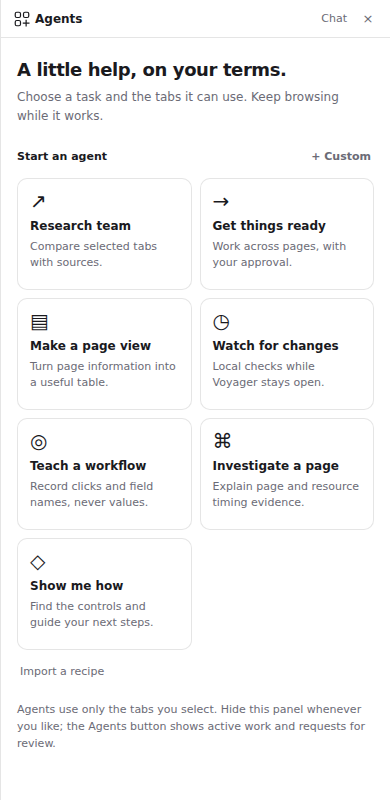

# Agents that work with your tabs

Click **Agents** beside the address bar, or press **Ctrl+Shift+A**
(**Command+Shift+A** on macOS). Choose a preset, select up to six open tabs,
and start. The side panel shows progress and results; hide it to keep browsing.
The Agents button shows active work and changes to **Review** when an action
needs your attention. Approval controls stay in Voyager's own interface.

*Actual renderer with a sample workspace. The launcher uses no floating page widgets.*

## Available agents

| Agent | What works in this implementation |
|---|---|
| Research team | Independently reviews selected sources, with at most two source readers in parallel, then synthesizes a cited result. Readers have no action tools or sibling-page context. |
| Get things ready | Inspects controls, requests approval for clicks, field replacement, scrolling and navigation within selected origins, and uses explicitly selected connector tools. Can group or split selected tabs. |
| Make a page view | Reads selected pages and creates local notes or sortable comparison tables with sources. The original sites are not modified. |
| Watch for changes | Compares bounded visible text on loaded pages every 15 seconds, one minute or five minutes. Runs locally for at most one hour, without page refreshes or model calls. |
| Teach a workflow | Records trusted clicks and field names on selected top-level pages. Field values are omitted. Review up to 24 steps, add expected text for click verification, and save a parameterized workflow. |
| Investigate a page | Reads page state, resource timings and redacted console errors collected during the run. Can request page actions to reproduce a problem and produce a guide. It cannot inspect cookies, headers, request bodies or server logs. |
| Show me how | Inspects visible controls and produces instructions in Voyager. It does not receive website click or fill tools. |

The model decides how to use its permitted tools. Results still need review for
accuracy, completeness and whether the source supports the answer. A page view
is local derived information; changing it does not update the original service.

## Create, import and reuse

Choose **+ Custom** to save a name, instructions and capability mode. Definitions
belong to the current profile. **Copy recipe** exports a definition; **Import a
recipe** accepts its JSON. Imported recipes receive new local identities and no
access until started. Unknown fields, executable code, unsupported capabilities
and oversized recipes are rejected. Saved instructions cannot override policy.

For a demonstrated workflow:

1. Choose **Teach a workflow** and the pages to record.
2. Perform the supported clicks and text edits. The recorder captures field
   names and creates parameters such as `field_1`; it does not capture values.
3. Choose **Finish recording**. Review every recorded step. For a button that
   changes the current page, enter text that should newly appear after its click.
4. Save the workflow. Start it on matching selected origins and supply its
   parameter values. Review each proposed action before it executes.

Replaying a recipe does not require a model. It resolves exact role/name matches
against a fresh snapshot each time; missing or ambiguous targets stop it. A link
destination or an expected new UI state can establish a local postcondition.
An unconfirmed effect stops the run, with no automatic retry.

## Approval and takeover

All website clicks, fills, scrolls, navigations and connector calls need an
explicit, single-use approval. The prompt shows the destination and exact text
or arguments. Filling a field replaces its contents; a website can immediately
transmit or autosave them. A verified field value is not proof of a remote save.

Approvals expire after one minute. Reloading or replacing the target, changing
profiles, changing privacy settings or stopping the run revokes access. Typing
or clicking in a page being operated by a workflow/investigation pauses that
agent. **Stop / take over** prevents new actions; it cannot recall a request that
has already been sent. Uncertain connector/navigation outcomes also stop further
actions, rather than retrying a potentially completed operation.

Only one workflow, investigation or recording runs per profile at a time; tabs
may share the same authenticated account. Up to three custom agents can be active
in a profile, allowing bounded research and watching alongside a workflow.
Each run is controlled from its originating window. This coordination applies
to custom agents; it is not a transaction lock on the remote website or a way to
control other people editing the same account.

## Data and limits

- AI presets require an Anthropic API key in **Settings → AI** and context-sharing
  consent. Selected page content, task text and explicitly approved connector
  results may be sent to Anthropic. Custom runs do not automatically include
  browsing history, saved memory or unselected tab metadata.
- Watching, recording and recorded-recipe replay run without model calls.
  Watchers inspect already-loaded pages; they do not fetch updates or continue
  after Voyager closes. Their current change detection compares text, rather
  than interpreting the meaning of a change with AI.
- Normal runs last at most five minutes and 24 tool steps. Model requests have
  input/output budgets and at most two concurrent source readers. A budget may
  stop a task before it finishes. These limits are not a fixed dollar-cost quote.
- Supported interactions cover top-level HTML, ordinary text inputs, textareas,
  and labeled contenteditable fields. Complex editors, virtualized controls,
  canvas, closed shadow roots and cross-origin frames may require manual work.
  There is no visual-coordinate fallback, credential tool or CAPTCHA solver.
- Agents cannot execute arbitrary JavaScript, shell commands or raw debugger
  commands. Normal Chromium sandbox, TLS, threat, download and connector
  protections remain in force. Agent tab permissions do not constrain all
  traffic generated by the website itself.
- Recognized sensitive fields, hidden text, URL query/fragment data and common
  secret patterns are filtered from observations. Filtering is not a guarantee
  that all confidential information on an allowed page is recognized. Diagnostics
  deserve particular care because application errors can contain private data.
- Definitions and the latest 20 run records per profile use the encrypted app
  database. Raw snapshots, field parameters and approval capabilities are not
  persisted. Results may contain selected page information; delete a run to
  remove its saved artifacts. Profile deletion removes its definitions and runs.
  Active grants are never restored after a restart. These records are not added
  to the sync bundle.

## Validation and further work

The source includes regression tests for selected-tab scope, capability modes,
profile ownership, worker context isolation, approval ownership/replay, navigation
races, ambiguous outcomes, connector failures, local watching and recording.
Packaged tests exercise the actual isolated preload, DOM replacement, ordinary
and rich-text field edits, autosave traffic, click postconditions, sandboxed IPC,
navigation during approval, and trusted demonstration/replay.

Renderer checks use an isolated sample workspace to exercise starting agents,
tab selection, activity/review badges while hidden, approvals, custom/imported
recipes, narrow and wide side panels, and dark mode. Scripted model responses
exercise orchestration without sending real browsing data to a provider. No
Anthropic test key was available in this environment; live model quality and
third-party account workflows still require evaluation with configured providers
and consenting test accounts. The Windows packaged suite passed all 23 checks, including trusted recording
and approved replay ([evidence run](https://github.com/keeganarko/voyager/actions/runs/33943244702)).
The source suite passed 167 tests. On this WSL host, 21 of 23 packaged checks
passed; its OS vault is unavailable and its desktop did not give the test window
input focus. Those two host-dependent checks passed on Windows. Windows previews are built
separately with test fixtures removed. They are unsigned testing builds. Download
the **voyager-windows-preview** artifact from the latest successful
[Security checks run](https://github.com/keeganarko/voyager/actions/workflows/security.yml).

This is an initial implementation of the [architecture](AGENT-ARCHITECTURE.md).
The design's arbitrary hierarchical delegation, semantic monitoring, general
site adapters, local-model routing, background OS service and visual targeting
are further work. It does not establish universal website compatibility or
production security readiness; existing [release requirements](SECURITY-OPERATIONS.md)
still apply.
